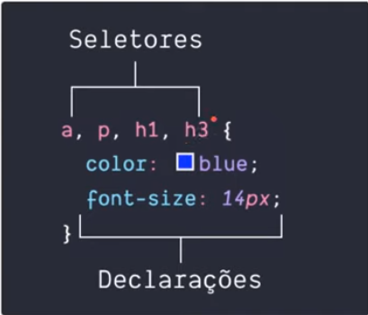
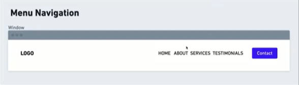
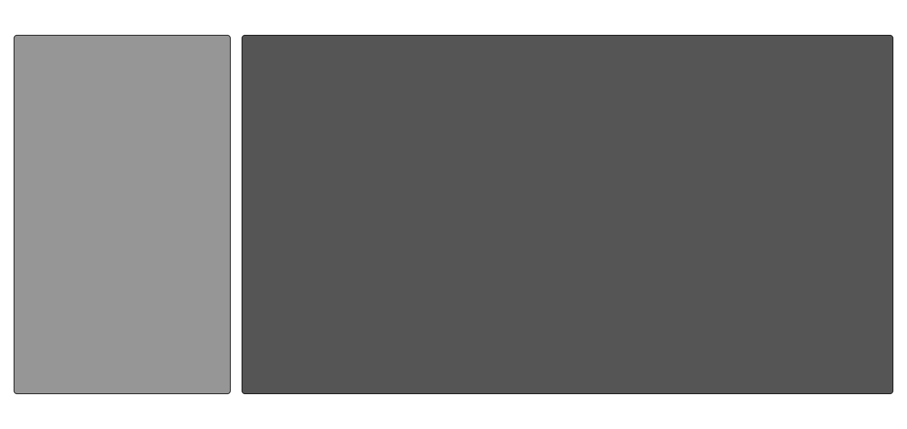

# CSS

## Conceitos Básicos

## Flexbox

- [Pasta do FlexBox](./FlexBox)

### ***Terminologia***
- Flex container
    - Flex item
- Nesting (conceito de que elementos vivem dentro de outro elemento)
- Axis (é a ideia de eixo )
    - main (Horizontal)
        - start, end
    - cross (cruzado)
        - start, end
- Flex sizing
    - flexível
    - altera width/height dois itens para preenchimento dos espaços do flex container (usando a proprieda de css flex:1 nos items você faz com que aja uma alteração de tamanho para que eles preenchão todo o container)

### ***Propiedades do flex Container***

**Direção dos itens**
- Flex é uma dimensão (horizontal ou vertical)
- podemos mudar a direção com `flex-direction`
- valores: (row | row-reverse | column | column-reverse)
- o valor padrão do flex-direction é o row (que no caso seria em linha), e o row-reverse ele meio que inverte a posição em linha 
- O valor column muda o eixo do flex fazendo todos os itens ficarem em posição vertical ou seja em coluna 

**Multi linhas** 
- [Pasta do FlexBox](./FlexBox/flex-wrap)
*flex-wrap* (Capacidade que o flex tem de usar multi linas)
- Podemos usar multi linhas 
- Cada nova linha, um novo felx container
- Exemplo: Se os itens não couberem mais na div por exemplo, a div tem `width:100px` e tem quatro itens cada um com `width:50px` usando o `flex-wrap` você avisa ao flex que quando os itens nao caberem mais no container é para quebrar linha

***flex-flow***
- shorthand
- flex-direction || flex-wrap
- Uma abreviação escrita assim `flex-flow: column wrap`
- Na abreviação vem primeiro o flex-direction depois o wrap

***Alinhamento***

*Eixo Principal (Horizontal)*

`justify-content`
- [Pasta do justify-content ](./FlexBox/justify-content)
 - Alinhamento dos elementos dentro do container 
 - Distribuiçao dos elementos

- *Valores*
    - flex-start (Alinha todos os itens do container horizontalmente no começo)
    - flex-end (Alinha todos os itens do container horizontalmente no fim)
    - center (Alinha todos os itens do container horizontalmente no começo)
    - space-around (Cria espaço ao redor dos elementos)
    - space-between (Cria espaço ao entre dos elementos)
    - space-evenly (Cria espaço ao por igual dos elementos ou seja o espaçamento será igual para todos os itens)

*Eixo Cruzado*

`align-items`
- [Pasta do justify-content ](./FlexBox/justify-content)
- Alinhamento dos elementos no eixo cruzado

*Valores*
- stretch(Padrão)
- flex-start (Deixaria eles alinahdos no começo do eixo vertical )
- flex-end (Deixaria eles alinahdos no fim do eixo vertical )
- center (Deixaria eles alinahdos no centro do eixo vertical )

**Espaços entre os itens**

`gap`
- [Pasta do justify-content ](./FlexBox/gap)
- Espaços entre os elementos 

*valores*
- Unidade de medidas 
- fixas: px, pt
- flexíveis: %, em, rem

## Propriedades para os itens

- [Pasta do uso de flex box para organizar itens na pagina](./FlexBox/Exemplo)

**flex-basis**
- Define o tamanho inicial dos elementos, em unidades de pixel, antes que o espaço remanescente seja redistribuído. O valor inicial desta propriedade é auto — neste caso o navegador observa se os itens possuem o mesmo tamanho.
**flex-grow**
- [Pasta do justify-content ](./FlexBox/flex-grow)
- O crescimento do item dentro do container em relação aos espaços vazios
- Faz com que o item com o atributo ocupe frações de espaço

**flex-shrink**
- [Pasta do justify-content ](./FlexBox/flex-shrink)
- A capacidade do item encolher dentro do container
**flex**
- shorthand
- flex-grow flex-shrink flex-basis
- podem ter 1,2 e 3 valores
**order**
- Serve para alterar a ordem dos itens 
- Não muda a estrutura html so muda visualmente 
- Começa com valor inicial de 0

### Desafios de flexbox
-  [Pasta dos desafios](./FlexBox/Desafios%20de%20Flexbox)

***1)*** Crie um `<header>` de um site que contenha uma logo e um menu 
- Um elemento deverá ficar um ao lado do outro.
- A logo que ficará na extrema esquerda e o menu ficará na extrema direita 
 - Os itens do menu ficarão um ao lado com um espaço de 8rem entre eles
 - O último elemento do menu será um botão de contato e você poderá utilizar o seletor `:lest-child` para estilizar
 - Obs: A imagem abaixo é apenas um exemplo você pode fazer esse desafio com o estilo que quiser

 

 

***2)*** Crie um layout com 2 colunas, uma ao lado da outra 
- A coluna da esquerda deverá ter 25% de tamanho e a coluna a direita deverá ocupar todo o espaço que sobra
- Faça uma separação de 1rem entre os elementos

 

