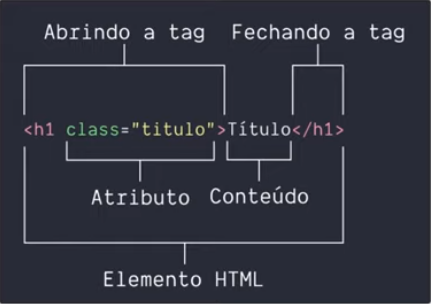

<h1 align="center">HTML</h1>

## Estrutura Básica:



- ***Documento HTML***

```html
<!DOCTYPE html><!-- Essa "tag" serve para mostrar ao navegador o que você está escevendo é um documento HTML-->

<html>

    <head><!-- Tag que é a cabeça do documento tudo que esta no head nao ira aparecer em tela no site -->
        
        <meta><!-- define qualquer informação de metadados que não podem ser definidos por outros elementos HTML.Conteúdo de metadado, geralmente é colocado charset que pode configurar os caracteres de acentução -->

        <title></title><!-- Titulo da pagina aquela que aparece nas apas do navegador -->

    </head>

    <body><!-- Tag que é o Corpo do documento ou site, aqui que será escrito o que irá aparecer no site -->

    </body>

</html>
```