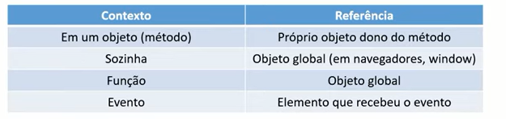
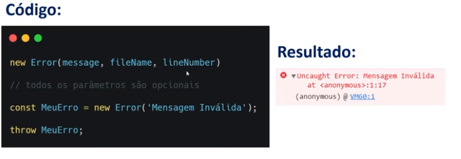
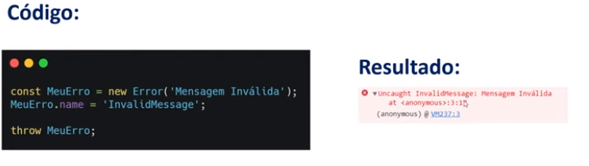
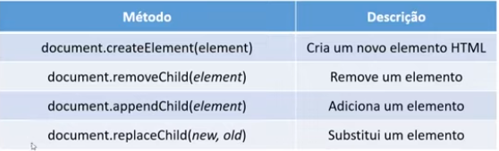
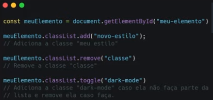
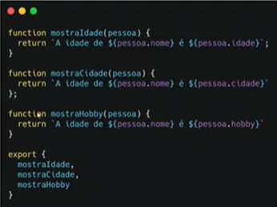
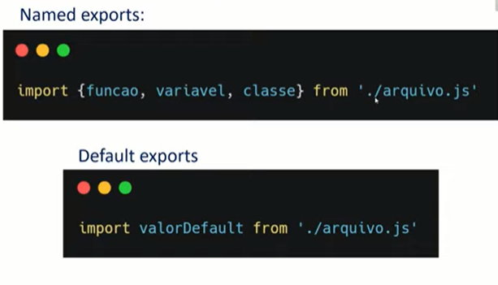
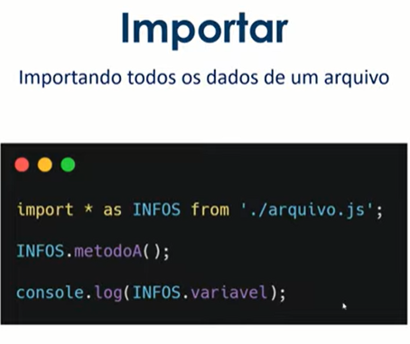

# ***JavaScript Core***

 - Linguagem de programação que roda no navegador do usuário (front-end)
    - Se você cilcar em algum botão da página e aparece uma janela. Isso é o JavaScript
    - Alteração do site ou aplicativo, conform a interação do usuário 
- Roda também no computador (back-end)

## O que podemos fazer ?
- Podemos criar aplicações web, mobile(React Native), desktop (Electron)
- Empresas famosas que usam:
    - Facebook (instagram, Whatsapp)
    - Google (Youtube, Gmail, Drive).
    - Uber
    - Netflix
    - TikTok
    - ...

- 99.99% dos sites na web usam JavaScript
- Linguagem obrigatória para que programa o Front-end Web

## Evolução

- A comunidade cresce cada vez mais e a linguagem está sempre evoluindo


## Começando

 **A importancia da Sintaxe**

- Toda linguegem tem
- Uma boa comunicação necessitade uma boa sintaxe
- 82% dos erros para iniciantes programação

**Maneira correta :** 
```js
    console.log("Olá, Mundo"); // O console.log('') serve para escreveruma mensagem no console do navegador
```

**Maneira errada ( Se esquecer de um ponto sequer o programa da erro)**

```js
    consolelog("Olá, Mundo");
```

**Comentários**
- no Javascricpt e em outras linguagens de programação um comentário serve para deixar observações ou alguma coisa que você queira 


    ```js
      // Usando "//" você cria um comentário em linha 
     ```
    ```js
    /* 
       Usando  barra asterisco você cria um comentário em bloco ou de multiplas linhas
    */
    ``` 
    - OBS: os comentarios não são enterpretados pelo navegador 


## Tipos de dados 


 - **String** 
- [Arquivo dos exemplos de strings](./Fundamentos/strings.js)
    - Cadeia de caracteres Ex : ABC
    - Para mostrar ou identificar uma string:
        - "" aspas duplas
        - '' aspas simples
        - ´´ template literals ou template string

        <br>


- **number**
- [Arquivo dos exemplos de numbers](./Fundamentos/number.js)
    - números
    
        - 33 (numeros inteiros)
        - 12.5 (numeros reais - float)
        - NaN (Not a Number - não é um número)
        - Infinity (infinito)

    <br>

- **Boolean**
- [Arquivo dos exemplos de boolean](./Fundamentos/boolean.js)
    - Somente 2 valores
        - true // verdadeiro
        - false // falso

    ```js
    console.log(true)
    console.log(false)
    ```
<br>

- **undefined**
    - indefinido

<br>

- ***null***
    - nulo
    - objeto que não possui nada dentro
    - diferente de indefinido

<br>

- ***Object***
- [Arquivo com mais exemplos](./Fundamentos/object.js)
    - Objeto
    - Propriedades / atributos
    - Funcionalidades / métodos
    - {propriedade: "valor"}
    - dado estrutural

    <br>

    ```js
    console.log({
        name: "Erick",
        idade: 18,
    })
    ```

***Object Destructuring***
- Entre chaves{}, podemos filtrar apenas os dados que nos interessam em um objeto.
- Funciona como se tirasemos as funções do objeto

```js

const user = {
    id:42,
    dispayName: 'jdoe',
    fullName:{
        firstName:"John",
        lastName:"Doe"
    }
};

// Fazendo isso vc transforma um atributo do objeto em uma variavel fora dele
let {id} = user;

console.log(id);


```
```js
const user = {
    id:42,
    dispayName: 'jdoe',
    fullName:{
        firstName:"John",
        lastName:"Doe"
    }
};
function userID({id}){
    return id;
}

function getFullName({fullName: {firstName: first, lastName:last}}){
    return `${first} ${last}`;
}

userId(user)//42

getFullName(user)//John Doe
```


<br>

- ***Array***
- [Arquivo com mais exemplos](./Fundamentos/arrays.js)
    - Ele funcina como uma lista
    - Ele agrupa dados

    <br>

    ```js
    console.log(["Erick , 18"])
    ```

    <br>

## ***Variáveis***
- [Arquivo com mais exemplos](./Fundamentos/Variaveis.js)
- São nomes simbólicos para receber algum valor
- atalhos de código 
- Identificadores
- 3 palavras reservadas para criar uma variável
    - var
    - let
    - const

       <br>

    ```js
        var numero = 1; //forma mais antiga de indicar uma variavel

        let clima = "quente"; // forma mais atual de indicar uma variavel

        const nome = "Erick"; //o const é uma forma de indicar uma constante ou seja não pode ser alterada durante a execução do código

        console.log(`${numero} ${clima} ${nome}`) // saida: 1 quente Erick
    ```

    <br>

- O JS é uma linguagem fracamente tipada e dinâmica
- ou seja variáveis não precisam ter um tipo previamente definido
- Podemos mudar o conteúdo da variável

### ***Scope***
- O scope(escopo) determina a visibilidade de alguma variável no JS
####  ***Block statement (Declaração de bloco)***

<br>

```js
//Vamos iniciar um bloco
{
    // aqui dentro é um bloco e posso colocar qualquer código

} // aqui dechamos o bloco
```
- O bloco , també criará um novo escopo. Chamamos de `block-scoped`

### ***var***

```js
// var é global e poderá funcionar fora de um escopo de bloco ou seja acontece o hoisting onde o JavaScript leva o var x para o começo do programa

console.log('> existe x antes do bloco? ', x);

{
    var x = 0;
}
console.log('> existe x depois do bloco? ', x);

```

### ***let***

```js
// const e let são locais e só funcinam no escopo onde foram criadas


console.log('> existe x antes do bloco? ', x);

{
    let x = 0;
    console.log('> existe x dentro do bloco? ', x);
}

console.log('> existe x depois do bloco? ', x);
```

### ***const***
- Funciona da mesma forma que o let entretanto o valor atribuido a ele não pode ser alterado durante a aplicação

## ***Nomeando variáveis***

* JS é case-sensitive (sensível ao caso)
* JS aceita a cadeia de caracteres Unicode

- ***Posso:***
    * Iniciar com esses caracteres especiais: $ _
    * Iniciar com letras
    * Colocar acentos 
    * Letras maíusculas e minúsculas fazem diferença
- ***Não posso:***
    * Iniciar com números 
    * Colocar espaços vazios no nome 
- ***Ideal***
    * Criar nomes que fazem sentido 
    * De preferencia um nome que explique o que a variável é ou faz
    * camelCase(usar letras maisuculas para cada troca de palavra ex: meuNome)
    * snake_case
    * Escrever em inglês
- statement (declaração)


## ***Functions***
- [Arquivo com mais exemplos](./Fundamentos/functions.js)
- As functions possuem duas finalidades 
    - Explicar o que um trecho de código faz 
    - Repetir esse trecho de codigo diversas vezes sem precisar copiar e colar
- Ela é um tipo de dado estrutural 

```js
function frase(){
    console.log("Bom dia");
    console.log("Boa Tarde");
    console.log("Boa noite");
}
frase();

/* Saída:

Bom dia
Boa Tarde
Boa noite
*/
```
### ***Argumentos e parâmetros :***
```js
//Função anonima , function expression, é quando você atribui o uma função a uma variavel sem colocar o nome da função

//num1 e num2 são parâmetors da função, servem como "variaveis" dentro da função onde quando a função for chamada os valores podem ser passados em forma de argumentos

const sum = function(num1,num2){
  console.log(num1+num2)
}
sum(2,3)// Arguments - Argumentos 


function findMax(){
    let max = -Infinity;

    for(let i = 0; i< arguments.length; i++){ //O arguments é um array com todos os parâmetros passados na função qua a ela foi invocada ou seja você não necessariamente precisa colocar valores que espera ser recebido, também ajuda caso tenha muitos valores como argumentos
        if(arguments[i] > max){
            max = arguments[i]
        }

    }
    return max
}
```
<br>


### ***Retornando valores dentro da função :***

```js
// Outra forma de retornar dados de uma função (de forma mais eficiente) é necessário usar o "return", e logo após dele colocar o dado que deve ser retornado no caso mostrado ao chamar a função
const sum = function(num1,num2){
  let total = num1+num2;
  return total
}

let number1= 30;
let number2=40;
console.log(`O numero 1 é ${number1}`);
console.log(`O numero 2 é ${number2}`)
console.log(`A soma entre eles é ${sum(number1,number2)}`)
```

<br>

### ***Function Scope :***
```js

let subject = 'create video';


// O valor de uma variável pode ser alterado dentro de uma função entretanto o valor que foi colocado na variável que está sendo usado como argumento so vai existir dentro do escopo da função, ou seja fora dela a variável continua com seu valor anterior   
function createThink(subject){
  subject='study'
  return subject;
  
}
console.log(subject);
console.log(createThink(subject))

/* Saida:

create video
study

*/
```

<br>

### ***Function hoisting :***
```js
sayMyName()

// No JavaScript (e outras linguagens de programação) as funções que são chamadas antes recebem um hoisting que siginifica "elevação" ou seja quando o programa iniciar ele vai "jogar" a função pra cima de todo o código fazemdo com que essa opção de chamar a função antes seja possivel
function sayMyName(){
  console.log("Erick")
}
```
- Casos onde a função não sofre elevação
```js
sayMyName()

// Quando é escrita em forma de expressão ela não será elevada ou seja todas as alternativas de escrver uma função abaixo irão dar erro

const sayMyName = function sayMyName(){
  console.log("Erick")
}

var sayMyName = function sayMyName(){
  console.log("Erick")
}
let sayMyName = function sayMyName(){
  console.log("Erick")
}
```

<br>

### ***Arrow Function :***
- Maneira mais moderna e compacta de escrever uma função
- Caso exista apenas uma linha, pode dispensar as chaves e o return
- Casi exista apenas um parÂmetro pode dispensar os parêntese
- Arrow function **NÃO** faz hoisting por ser obrigatoriamente declarada com const
- **"this"** sempre será o objeto global. Métodos para modificar seu valor não irão funcionar
- Não existe o objeto "Argumets"
- O contruir (ex: new MeuObjeto()) também não pode ser utilizado
```javascript

//Geralmente é usado o const para fazer uma arrow function mas não é obrigatório pode usar outros modos de declarar variáveis

const sayMyName = () => {
  console.log('Erick')
}

sayMyName()


const name = () => "Erick";//Forma resumida

name()
// "Erick"

const number = a/*Parâmetro*/ => a

number(4)
// 4
```

### ***callback function :***
- É uma função que recebe uma função como parâmetro ou uma função que serve de parâmetro para outra função (as duas são a mesma coisa , rs)

```js

function sayMyName (name) {
  console.log('Antes de executar a funcao callback');

  name();

  console.log('Despois de executar a função callback')
  
}


sayMyName(
    () =>{
        console.log('Estou em uma callback');
    }

);
```

<br>

### ***Funções Construtoras :***

```js
//Funciona como um objeto usando a palavra chave "new" você cria o objeto, para criar "Caracteristicas" basta usar a palavra chave "this"

function Person(name){
  this.name = name
} 

const erick = new Person("Erick");

console.log(erick)
```


### ***O que é This?***

- A palavra reservada **this** é uma referência de contexto.
- No exemplo, this refere-se ao objeto pessoa
- Quando uma função está dentro de um objeto chamamos ela de método, então quando se usa o this ele se refere ao objeto pai desse método

```js
    const pessoa = {
        firstName:"André",
        lastName:"Soares",
        id: 1,
        fullName: function(){
            return this.firstName + " " + this.lastName
        },
        getId: function(){
            return this.id;
        }

    }
    pessoa.fullName();
    // "André Soares"
    
    pessoa.getId();
    // 1

```
- Seu valor pode mudar de acordo com o lugar no código onde foi chamada



<br>

***Call***

```js
const pessoa = {
    nome: "Miguel",
}

const animal = {
    nome: "Murphy",
}

function getSomething(){
    console.log(this.nome);//Mas o this não iria se referir a um objeto ou função pai? Ou seja ele iria se referir a essa função getSomething()?
}

getSomething.call(pessoa);//Usando metodo .call antes da função você pode especificar qual a obj que será o pai,ou seja colocando o call você pode mostrar qual obj que o this se refira
```
- É possível passar parâmetros para essa fução separando-os por vírgulas.
```js
const myObj = {
    num1: 2,
    num2: 4,
};
function soma(a,b){
    console.log(this.num1 + this.num2 + a + b)
}

soma.call(myObj, 1, 5)
//Saída: 12
```

***Apply***

```js
const pessoa = {
    nome: "Miguel",
}

const animal = {
    nome: "Murphy",
}

function getSomething(){
    console.log(this.nome);
}

getSomething.appy(pessoa);//funciona quase da mesma forma que o .call so com uma pequena diferença que logo veremos
```
- É possível passar parâmetros para essa fução separando-os por vírgulas.
```js
const myObj = {
    num1: 2,
    num2: 4,
};
function soma(a,b){
    console.log(this.num1 + this.num2 + a + b)
}

soma.appy(myObj, [1, 5])//É ssa é a diferença, nele é possivel passar parâmetros para a função dentro de um array
//Saída: 12
```

***Bind***
- Clona a estrutura da função onde é chamada e aplica o valor do objeto passado como parâmetro

```js
const retornaNomes = function(){
    return this.nome;
}
let bruno = retornaNomes.bind({nome:"Bruno"})

bruno()

```
<br>

## ***Manipulando dados***

### ***Type conversion coersion***
 - Alteração de um tipo de dado
 - **Type conversion ( typecasting )** : Altera explicitamente um tipo de dado para o outro
 - **Type coersion** : É quando o JavaScript altera impicitamente
 ```js
 // O Javascript quando ele se depara com esse código ele vai coverter o 5 em uma string para que o programa não apresente erros, ou seja, em vez de somar ele vai concatenar as duas string
console.log('9'+ 5)
// Saída:  95

// Aqui você esta alterando o valor string em número ou seja o '9' vai valer 9 ou seja a soma irá ser feita corretamente
console.log(Number('9') + 5)
//Saída: 14
```

```js
// Contar quantos caracteres tem uma palavra e quantos digitios tem um número
let word = "Paralelepipedo";
console.log(word.length);

// Dados de tipo number não recebem o .length ou seja para mostrar quantos caracteres ele possui precisa transforma-lo em string
let number =1234;
console.log(String(number).length)
```

### ***Manipulando Strings e Números***

```js
// Transforamr um número quebrado com duas casas decimais e trocar ponto por vírgula

let number = 473838.373838;
/* O .toFixed serve para colocar um limite de números após a vírgula, ela é uma função atrelada ao objeto number,
 quando uma função é atrelada ao um objeto chamamos de método, 
 e dentro dos parentese ele espera a quantidade de números após a vírgula o retorno disso será uma string*/
console.log(number.toFixed(2).replace(".",","))

// Para trocar o ponto por virgula basta usar o .replace("O que você quer trocar"  ,  "O que vc que colocar no lugar")
```
<br>

```js
// Transforme letras minúsculas em maiúsculas. Faça o contrario disso também


let word = "Olá mundo";
//Maiúsculas
console.log(word.toUpperCase())//Tudo em JS é um objeto ou seja a variavel word é um objeto que recebe o metodo .toUpperCase e esse metodo so funciona com strings

//Minúsculas
console.log(word.toLowerCase())

```
<br>

```js
// Verificar se o texto contém a palavra Programar

let phrase = "Eu gosto de ler"

// O metodo .includes funciona para verificar se tem ou não dentro da frase o que foi colocado detro do parenteses  
console.log(phrase.includes("Programar"))

// Observação: o .includes é case sensitive ou seja maiúsculas e minúsculas fazem diferença se colocar na frase programar em minúsculas o programa da erro

```

<br>

## Manipulando Strings e Arrays
```js
// Separe um texto que contem espaços, em um novo array onde cada texto é uma posição do array. Depois disso, transforme o array em um texto e onde eram espaços, coloque _

let phrase = "Eu gosto de programar"

//O metodo .split recebe como argumento um caractere que apartir dele a frase será dividida e colocada em um array
let myArray = phrase.split(" ")

// O metodo .join serve para unir arrays e dentro do parenteses fica qual será o separador
let phraseWithUnderscore = myArray.join("_")
console.log(phraseWithUnderscore )

```

<br>

```js

//Spread: uma forma de lidar separadamente com elementos 
function sum(x, y, z){
    return x + y + z
}
const numbers = [1, 2, 3]
// Usando o reticências antes de uma variavel que está sendo passada como parâmetro você pode meio que separa-la indice por indice fazendo com que ela se torne um elemento idependente
// O spread é usado quando você chama a função
console.log(sum(...numbers));

//Rest: combina os argumentos em um array
// O que era um eleemento idependente se torna parte de um array. Funciona da forma inversa do spread
// O rest você usa quando você delcara a função
function confereTamanho(...args){
    console.log(args.length)
}
confereTamanho(1, 2)// 2 

// Contar elementos de um array

let array =[2,4,5,5,6,7]

console.log(array.length)
```

<br>

```js
// Transformar uma cadeia de caracteres em elemntos de um array

let word = "Manipulação"
// Array é um objeto disponivel de forma global no código e o metodo .from espera receber como argumento uma string 
console.log(Array.from(word))
```

<br>

```js
// Manipulando Arrays

let techs = ["html","css","js"]

// Adicionar um item no fim
//O metodo .push identifica qual é o ultimo item do array e adiciona o que foi colocado como argumento dentro dos parenteses
techs.push("node.js")


// itera um array
//Ele vai passar pelos items de um array executando a função que foi passada como parÂmetro
techs.forEach(funtion(item, index){
    console.log(item , index)
})

// Adicionar no começo
// Funciona da do meio inverso ao do push
techs.unshift("sql")

//Remover do fim
// Basta apenas colocar o metodo .pop() que ele simplesmente retira o ultimo item do array
techs.pop()

// Remover do começo
// Basta apenas colocar o metodo .shift()  que ele retira um item do começo
techs.shift()

// Pegar somente alguns elementos do array
// Usando o .slice() você meio que "corta" e mostra somente de qual posição ate qual posição você quer ver

console.log(techs.slice(1,3))

// Remover 1 ou mais items em qualquer posição do array
// o metodo .splice(qual posição no array, quantidade de items a serem retirados) serve para retirar 1 ou mais itens de um array

//techs.splice(1,2)

// Encontrar a posição de um elemento no array
// O metodo .indexOf() serve para procurar qual a posição do item dado como parametro dentro do array e o valor que será encotrado sera colocado na variavel index
let index = techs.indexOf('css')

console.log(index)

```

<br>

## Expressões e operadores
- Expressions ( É Qualquer linha de código que resolve um problema)

```js
// Você declarar uma variavel para armazenar um dado de certa forma você resolveu um problema 
    let number 
```
- Operators 
    - Binary
 ```js
 // o BINARIO é quando usa dois operadorandos 
    let number=1
    
    console.log(number + 1)
```
    - Unary
```js
    // o Unario é quando usa somente um opradorandos
    let number=1
    // usando o ++ vocÊ incrementa 1 a variavel
    console.log(number++)
    // Usando -- você decrementa 1 da variavel
    console.log(number--)
```

    - Ternary
 ```js
    // o TERNARIO é quando você verifica se é verdadeiro ou falso funciona como um if que veremos mais a frente
    let number=1
    // Primeiro:   Teste logico, seguido por um ? pra indicar uma condicional, primeiro se for verdadeira e a segunda a falsa 
    console.log(number=1 ? "alo":"nada")
 
```

### ***new***
- left-hand-side expression
- Criar um novo objeto
```js
// o new é usado para criar objetos usando as funções construtoras do JS no caso do exemplo abaixo o String é uma função construtora
    let name = new String('Erick')
    name.surName = "Willian"

    console.log(name)
```

### Opearadores unários

- typeof
```js
    // Serve para mostrar qual é o tipo de dado do elemento depois dele

    let name = "Erick"

    console.log(typeof name)
```

<br>

- delete
```js
    //Serve para deletar um item de um objeto

    const person = {
        name:'Erick',
        age:18,
    }

    delete person.age

    console.log(person)
```

<br>

### ***Operadores Aritiméticos***

- Multiplicação
- Divisão
- Soma
- Subtração
```js 
    console.log(3*5)//Multiplicação
    console.log(3/5)//Divisão
    console.log(3+5)//Soma
    console.log(3-5)//Subtração
```

- Resto da divisão
- Incremento 
- Decremento
- Exponencial
```js 
    console.log(3%5)//Resto da divisão
    console.log(++3)//Incremento
    console.log(--3)//Decremento
    console.log(3**5)//Exponencial
```

### Grouping operator( )
```js 
    // assim como na matemática existe a ordem de precedência na programação tambem existe isso 

    let conta1 = 2 + 3 * 5// Resultado: 17
    let conta2 = (2 + 3) * 5 //Resultado 25
```

### ***Operadores de comparação***
- Irá comparar valores e retornar um Boolean como esposta á comparação

```js
    let one = 1;
    let two = 2;

    // == igual a 
    
    console.log(two==1);//False
    console.log(one=="1");//True

    // !=  diferente de

    console.log(one != two)//True
    console.log(one != 1)//False
    console.log(one != "1")//False

    // === estritamente igual a ou identico a 
    console.log(one === "1")//False
    console.log(one === 1)//True

    // !== estritamente diferente de 
    console.log(two !== "2")//True
    console.log(two !== 2)//false

    // >   Maior que
    console.log(one > two)//False

    // >=  Maior igual a
    console.log(one >= 1)//True
    console.log(two >= 1)//True

    // <   Menor que
    console.log(one < two)//true

    // <=  Menor igual a
    console.log(one <= two)//true
    console.log(one <= 1)//True
    console.log(one <= 0)//False
```

### ***Operadores de atribuição (Assignment)***

```js
    let x;
    console.log(x);

    // Assignment
    x = 1;
    console.log(x);

    //Addition Assignment
    //Essa é uma meneira simplificada de fazer x = x + 2
    x += 2;
    console.log(x);

    //Subtraction Assignment
    //Essa é uma meneira simplificada de fazer x = x - 2
    x -= 1;
    console.log(x);

    //Multiplication Assignment
    //Essa é uma meneira simplificada de fazer x = x * 2
    x *= 2;
    console.log(x);

    //Division Assignment;
    //Essa é uma meneira simplificada de fazer x = x / 2
    x /= 2;
    console.log(x);

    //Remainder Assignment
    x %= 2;

    //Exponetiation Assignment
    x **= 2;
```

### ***Operadores Lógicos (logical operators)***

```js
    //2 valores booleanos, quando verificados,
    //resultará em vertadeiro ou falso

    let pao = true;
    let queijo = true;

    // AND && (esse operador so vai retornar true quando os dois elementos forem true)
    console.log(pao && queijo);

    //OR || (esse operador vai retornar true sempre que tiver pelo menos uma condição verdadeira)
    console.log(pao || queijo);

    // NOT ! (Serve para negar uma condição)
    console.log(!number)
```

<br>

### Operador Condicional (Ternário)
- [Arquivo com mais exemplos](./Fundamentos/ternario.js)
```js
    //Dependendo da condição, nós receberemos valores diferentes 
    // Condição então valor 1 se não valor 2
    // o sinal de ? serve pra começar uma condicional
    //e o sinal de : serve para separar o que será feito se uma condição for true ou false
    // condition ? value1 : value2

    //Café da manhã top
    let pao = true;
    let queijo = true;

    const niceBreakFast = pao && queijo ? "Café top" : "Café ruim";

    console.log(niceBreakFast);
```

<br>

### Operador de String (String operator)

```js
    // Comparison (comparação)
    console.log('a'== 'b');

    // concatenation (Concatenação)
    //Retorna a união de dusas Strings
    console.log('a'+'b'); 
```

<br>

### Falsy

- Quando um valor é considerado false em contextos onde um booleano é obrigatorio (condicionais e loops)
    - false
    - 0
    - -0
    - ""
    - null
    - undefined
    - NaN

```js
    console.log( 0 ? 'verdadeiro' : 'falso')
    //Saida: false
```

<br>

### TRUTHY

- Quando um valor é considerado true em contextos onde um booleano é obriagtório ( condicionais e loops )
    - true
    - {}
    - []
    - 1
    - 3.23
    - "0"
    - "false"
    - -1
    - infinity
    - -infinity

```js
    console.log( 1 ? 'verdadeiro' : 'falso')
    //Saida: true
```

<br>

### Operator precedence (Precedência de operadores)
 - 1ª grouping:  ()
 - 2ª negação, incremento e decremento: ! ++ --
 - 3ª multiplicação e divisão: * /
 - 4ª adição e subtração: + -
 - 5ª relacional: < <= > >= 
 - 6ª igualdade == != === !== 
 - 7ª AND : && 
 - 8ª OR : || 
 - 9ª condicional : ?: 
 - 9ª assignment (atribuição): = += -= *=  

 ## ***Condicionais e controle de fluxo***

 ### ***if e else***
 - [Arquivo com mais exemplos](./Estruturas%20de%20Controle/if.js)
 ```js
    //Serve para tomada de decisão

    /*
    se(condição){
        o codigo que será excutado se for 
        verdadeira
    }se nao{
        o codigo que será executado se for
        falso
    }
    */
let temperature = 38.5;

   if(temperature>=37.5){
    console.log("Febre alta");
   }else if(temperature < 37.5 && temperature >=37 ){
    console.log("Febre media");
   }else{
    console.log("Saudável")
   }
 ```

 <br>

 ### ***switch***
- [Arquivo com mais exemplos](./Estruturas%20de%20Controle/switch.js)
```js 
    //Funciona como um if com mais casos  
    switch(expression){
        case "a":
            //codigo
            break
        case "b":
            //codigo
        default:
    }
```

<br>

### ***throw e try/catch***
- [Arquivo com mais exemplos](./Fundamentos/erro.js)
- Na tradução de *throw* siginifica *"Disparar"* ou *"Lançar"* serve para disparar uma mensagem de erro 
- Na tradução de *try* siginifica *"tentar"*  serve para executar uma função sem que de erro
- Na tradução de *catch* siginifica *"pegar"* ou seja serve para guardar a mensagem de erro caso o programa ou funçao apresente tal 

```js
    function sayMyName(name=""){
        if(name==""){
            throw "Nome é obirgatório"; //serve para criar uma mensagem de erro personalizada
        }
        console.log("Depois do erro")

    }
try{
    //Aqui ele tenta executar
    sayMyName();
}catch(e){
    //Aqui ele guarda a mensagem de erro dentro da variavel "e"
    //Serve para manipular o erro de forma personalizada
    console.log(e)
}
```
### Objeto Error




<br>

## Estrutura de repetição

### ***for***
- Na tradução significa *"para"*

```js
//break - para a execução do loop
//continue - pula a execução do momento
    for(let i=0;i<=100;i++){
        if(i === 50){
            break
        }
        console.log(i)
    }
```

<br>

### ***while***

- Na tradução significa em enquanto
```js
    let i=0
    while(1<10){
        console.log(i);
        i++;
    }
```

<br>

### ***for...of***
- É um for para arrays e strings 
- Loop enter estruturas iteráveis ou seja estruturas que possui posições 
```js
    let name ='Erick'
    let names = ['Gustavo','Maria','Pedro']

    for(let char of name){
        console.log(char)
        //Ele irá retornar letra por letra
        
    }
```

<br>

### for...in
- Vai criar um loop emcima de um objeto (usando os elementos do objeto no caso)
- Loop entre proepriedades enumeráveis de um objeto porque um objeto não possui indices/posições
```js
    let person ={
        name:'Jhon';
        age:30;
        weight:88.6;

    }
    for(let property in person){
        console.log(property)
        //saida name, age, weight
        //Fazendo dessa forma so irá sair o nome das keys de um objeto
    }
      for(let property in person){
        console.log(person[property])
        //saida Jhon, 30, 88.6
        //Fazendo dessa forma so irá os valores de cada objeto
    }
```

## Exercicios básicos
- 1-Transformar notas escolares
    - Crie um algoritimo que transforme as notas do sistema numérico para sistema de notas em caracteres tipo A B C
        -  De 90 para cima: A
        -  Enter 80-89: B
        -  Entre70-79: C
        -  Entre 60-69: D
        -  Menor  que 60: F
```js
function notaTransformada(nota){
  if(nota >= 90 && nota<=100>){
    console.log("Parabéms tirou A")
  }else if(nota>=80 && nota <=89 ){
    console.log("Tirou B")
  }else if(nota>=70 && nota<=79){
    console.log("Tirou C")
  }else if(nota>=60 && nota<=69){
    console.log("Tirou D")
  }else if(nota<60){
    console.log("Infelizmente você tirou F")
  }else{
    console.log("Nota invalida")
  }
    
}
notaTransformada(72);
```
- Outra forma:
```js


function finalScore(score){
    let scoreA = score>=90 && score<=100;
    let scoreB = score>=80 && score<=89;
    let scoreC = score>=70 && score<=79;
    let scoreD = score>=60 && score<=69;
    let scoreF = score<=60 && score>=0;
  
        if(scoreA){
            console.log("A");
        }else if(scoreB){
            console.log("B");
        }else if(scoreC){
            console.log("C");
        }else if(scoreD){
            console.log("D");
        }else if(scoreF){
            console.log("F");
        }else{
            console.log("Valor inválido !");
        }
}

finalScore(69);
```
- 2-Crie um objeto com2 prorpiedeades, ambas do tipo array:
    - receitas:[]
    - despesas:[]
    - Agora , cria uma função que irá calcular o total de receitas e despesas e irá mostrar uma mensagem se a família está com saldo positivo ou negativo, seguindo o valor do saldo
```js
 
  let family={
    receitas:[1000,2000,200],
    despesas:[200,300,440],
  }
function sum(array){
  let total=0;
  for(let value of array){
    total += value
  }
  return total;
}
function calculateBalance(){
  const receitaFamily = sum(family.receitas)
  const despesaFamily = sum(family.despesas);
  
  let dinheiro = receitaFamily-despesaFamily;
  
  console.log(dinheiro);
}
calculateBalance()
```

<br>

# DOM (Document Object Model)
- [Pasta com exemplos de DOM](./DOM)
- É o HTML convertido para um Objeto JavaScript
- API que representa e interage com o html
- Estrutura de dados de tipo árvore, criada pelo browser
- OBS: API é tudo aquilo que te auxilia a interagir com algo

## Para que serve ?
- JavaScript usa a DOM para se conectar ao HTML
- Manipular o HTML com o JavaScript 
- Você só programa para WEB porque existe a DOM 


## Selecionando Elementos
- [Pasta do Selecionando Elementos](./DOM/SelecionandoElementos)

```js
    //document.getElementById("") serve para selecionar elementos HTML atravez do ID
    // Como pode se ver usamos um item do objeto document o .getElementById("")
    // Colocando dentro dos parentes o ID você seleciona o elemento

    const titulo = document.getElementById("titulo")
    console.log(titulo);

```

```js
    //document.getElementsByClassName("") serve para selecionar elementos HTML atravez da classe
    // Como pode se ver usamos um item do objeto document o .getElementsByClassName("")
    // Colocando dentro dos parentes o class você seleciona o elemento
    // Com ele você pode selecionar diversos elementos com a mesma classe
    // Retorna um HTMLCollection
    const paragrafo = document.getElementsByClassName("paragrafo")
    console.log(paragrafo)

```


```js
    //document.getElementsByTagName("") serve para selecionar elementos HTML atravez da Tag HTML
    // Como pode se ver usamos um item do objeto document o .getElementsByTagName("")
    // Colocando dentro dos parentes o class você seleciona o elemento
    // Com ele você pode selecionar diversos elementos com a mesma tag

    const main = document.getElementsByTagName("main")
    console.log(main)

```

```js
    //document.querySelector("") serve para selecionar elementos HTML atravez do seletor CSS
    // Como pode se ver usamos um item do objeto document o .querySelector("")
    // Colocando dentro dos parentes o class você seleciona o elemento
    // O querySelector seleciona o primeiro item com o seletor CSS dentro do parenteses

    const element = document.querySelector(".element")
    console.log(element)

```

```js
    //document.querySelector("") serve para selecionar elementos HTML atravez do seletor CSS
    // Como pode se ver usamos um item do objeto document o .querySelector("")
    // Colocando dentro dos parentes o class você seleciona o elemento
    // O querySelector seleciona o primeiro item que ele achar na página com o seletor CSS dentro do parenteses

    const element = document.querySelector(".element")
    console.log(element)

```

```js
    //document.querySelectorAll("") serve para selecionar elementos HTML atravez do seletor CSS
    // Como pode se ver usamos um item do objeto document o .querySelector("")
    // Colocando dentro dos parentes o class você seleciona o elemento
    // O querySelector seleciona todos os items com o seletor CSS dentro do parenteses
    // Vai retornar um Nodelist
    const p = document.querySelectorAll(".paragrafo")
    console.log(p)

```

## Manipulando Conteúdos 

```js

// textContent serve para colocar conteudo em uma tag especifica que foi selecionada anteriormente
//

const element = document.querySelector("h1")
element.textContent = "Olá devs"

```

<br>

```js
//innerText serve para alterar um texto interno de uma tag que foi antes especificada

const text =  document.querySelector("p")
text.innerText = "Esse texto foi adicionado com o innerText"

```

<br>

```js
// innerHTML alterar o conteudo HTML interno
//funciona da mesma forma que o innerText mas com uma peculiaridade pode se colocar tags html dentro dele 

element.innerHTML = "Olá devs! <button>innerHTML</button>"

```

<br>

```js
//value serve para alterar o valor de um input
// 

const input = document.querySelector("input")

input.value = "Valor que eu quiser"

```

<br>

```js
// Atributos
// setAttribute Adiciona um novo atributo ou modifica o valor de um atributo existente num elemento específico.
// Sintaxe: element.setAttribute(name, value);
const header = document.querySelector("header")
header.setAttribute("id", "header")

const headerID = document.querySelector("#header")


// o getAttribute serve para pegar o atributo de uma tag
console.log(headerID.getAttribute("id"))


// Usando o .removeAttribute voce pode remover um atributo de um elemento html
header.removeAttribute("id")
```

## Manipulando estilos e classes
- [Pasta](./DOM/Estilos%20e%20Classes)

```js
//Alterando estilos
const body = document.querySelector("body")
// Usando o .style você pode usar as propriedades CSS
body.style.backgroundColor = "#f9f3D2"
```
```js
// classList

const element = document.querySelector("header")
// Usando o .classList.add(nome da classe) você pode adicionar uma classe ao elemento html
element.classList.add("bg", "font")

//Serve para remover a classe do elemento HTML
element.classList.remove("bg")

//O .toggle vai pesquisar no html se a classe existir ele ira tirar se não ele ira colocar
element.classList.toggle("bg")
```

## Navegando pelos elementos

```js
// Navegando pelos elementos
// .parentNode e parentElement
//Serve para selecionar o elemento "pai" do elemento entre parenteses
const body = document.querySelector("body")

console.log(body.parentNode)
//Saída: HTML
```

```js
// Pegando elementos filhos
// .parentNode e parentElement
//Serve para selecionar o elemento "pai" do elemento entre parenteses
const body = document.querySelector("body")

console.log(body.parentNode)
//Saída: HTML
```

## Criando e adicionando elementos na página
```js
// Criando adicionando elementos

// createElement
// Serve para criar um elemento HTML
const div = document.createElement("div")
div.innerText = "Olá Devs !"


// append prepend
const body = document.querySelector("body")


// o append serve para adicionar um elemento criado
// Coloca após o a tag do html
body.append(div)


// o prepend serve tambem para adicionar
// Coloca o elemento antes de qualquer outra 
// ou seja coloca como primeiro filho 
body.prepend(div)

// insertBefore
// Serve para inserir um elemento antes de algo 
// .insertBefore(elemento que será adicionado, antes de qual tag ele deve ser adicionado )
const script = body.querySelector("script")
body.insertBefore(div, script)
```

## Eventos
```js
// Eventos
function print(){
    console.log("Você clicou em mim")
}


// Eventos de teclado
const input = document.querySelector("input")
input.onkeypress = function(){
    console.log("rodei")
}
//Adicionando eventos via JS
const h1 = document.querySelector("h1")
// .addEventListener É como um ovidor de eventos ele fica de olho no html esperando que o evento aconteça
// addEventListener(Primeiro vem o tipo do evento,   depois qual função ele vai executar caso esse evento aconteça)
h1.addEventListener("click", print)

input.onkeydown = function(event){
    console.log(event.key)// Mostra as teclas digitadas
    console.log(event.currentTarget.value)//Usado para pegar o valor dentro do input
}

```

<br>



<br>



### **Tipos mais usados de eventos**

- Eventos de mouse
    - mouseover : quando o mause esta dentro da div
    - mouseout : quando o mause sai da div
- Eventos de clicque
    - click : quando você clica em algo
    - dbclick : quando você da um duplo click
- Eventos de Atualização
    - Change  : usado quando um campo é alterado 
    - load

## JavaScript Assíncrono
- Um código assíncrono leva um tempo para ser executado, e pode ser bem sucedido ou não, funciona como se estivesse fazendo duas coisas ao mesmo tempo
    - Chamadas para APIs
    - Interações com banco de dados
- Há 3 maneiras de lidar com esse tipo de código
    - Callbacks (Uma função que é passada para ser executada em um momento mais tarde )
    - Promises
    - Promises com Async/Await

```javascript
// Callback 
// setTimeout(function, milliseconds) 
// Nesse exemplo a constante esta recebendo uma arrow function com os parametros email e password e dentro dela a função setTimeout() que recebe primeiro um arrow function como parametro e depois o tempo que ela vai receber para que o javacript espere para executa-la
const loginUser = (email, password, callback) =>{
    setTimeout(() =>{
        console.log("User Logado")
    callback ({ email })
    }, 1500);
}

const user = loginUser("junindomorro@gmail.com","123456",(user) =>{

    console.log( {user} )
})


```
```javascript
// Promises

const loginUserPromises = (email, password) =>{
    return new Promise((resolve, reject) =>{
        const error = false

        if(error){
            reject(new Error("Error in login"));
        }
        console.log("User logged!")
        resolve({email})
    })
}
loginUserPromises("junindomorro@gmail.com","123456").then((user) =>{// O then traduzido significa "então" ou seja depois de ele ver a promisse ele vai executar a função recebendo os valores do "resolve" no caso a arrow func esta recebendo o vaalor do resolve o paramatro "user"
    console.log({user})
}).catch((error) => {//o catch pega o erro que foi dado no reject e passa para o parametro da função callback no caso o "error"
    console.log({error})
});
```

```javascript
// Promises exemplo mais complexo

const loginUserPromises = (email, password) =>{
    return new Promise((resolve, reject) =>{
        const error = false

        if(error){
            reject(new Error("Error in login"));
        }
        console.log("User logged!")
        resolve({email})
    })
}

const getUserVideos = (email) =>{
    return new Promise((resolve, reject) =>{
        setTimeout(() =>{
            resolve(["video1"], ["video2"]);
        }, 2000)
    })
}

const getVideoDetais = (video) => {
     return new Promise((resolve, reject) =>{
        setTimeout(() =>{
            resolve({title:"Video title"});
        }, 2500);
    })
}

loginUserPromises("junindomorro@gmail.com","123456")
.then((user) =>{
    return getUserVideos(user.email);
}).then((videos) => {
    getVideoDetais(videos[0])
}).catch((error) => {
    console.log({error})
});

```
```javascript
//Async/Await

const loginUserPromises = (email, password) =>{
    return new Promise((resolve, reject) =>{
        const error = false

        if(error){
            reject(new Error("Error in login"));
        }
        console.log("User logged!")
        resolve({email})
    })
}

const getUserVideos = (email) =>{
    return new Promise((resolve, reject) =>{
        setTimeout(() =>{
            resolve(["video1"], ["video2"]);
        }, 2000)
    })
}

const getVideoDetais = (video) => {
     return new Promise((resolve, reject) =>{
        setTimeout(() =>{
            resolve({title:"Video title"});
        }, 2500);
    })
}

//É uma forma de consumir promises de forma mais facil sem precisar usar o .then varias vezes de certa forma fica mais natural e facil
const displayUser = async () =>{
    const user = await loginUser("junindomorro@gmail.com","123456")
    console.log({user})
}
dispayUser();

```

## Utiliando Módulos
- [Pasta](./Modulos)
- Módulos são arquivos JavaScript que tem a capacidade de exportar e importar impormações de outros arquivos do mesmo tipo

### ***Algumas Vantagens são:***
- Organização de código
- Compratilhamento de variáveis em escopos diferentes
- Explicita as dependencias dos arquivos
- Boa Prática ao usar Modulos é usar a extenção .mjs para arquivos javascript que serão usado de modulos ou seja aqueles que serão exportados






- Pra caso tiver uma função com mesmo none você pode dar um apelido ao arquivo importado




> ### Exportando no node
```javascript

//Depois de fazer o codigo todo para exportar basta usar:

function funcao(){
    console.log("Olá mundo");
}

module.exports = { funcao };
```

> ### Importando com node:
```javascript
// Depois de criar um arquivo para importar ele para o arquivo principal basta usar:

const funcoes = require('Caminho da pasta deve ser colocado aqui')// Isso irá retornar um objeto com todas as funções do arquivo
```

## Orientação a Objetos com JavaScript (Formas de programar)
***Imperativo (imperative)***(Falar como as coisas vao cer chamadas)
- Como vai resolver os problemas 
    - Precedural
    - Object Oriented 
    - Parallel Processing

***Declarativos***
- O que vai fazer (Banco de dados)
    - Logic
    - Functional : Dataflow
    - Database

**Paradigmas da orientação objeto**
- Os programs são "objetos" que possuem uma série de propriedades.

*Pilares*
- Herança
    - O objeto filho herda propriedades e métodos do objeto pai
- Polimorfismo
    - Objetos podem herdar a mesma classe pai, mas se comportarem de forma diferente quando invocamos seus métodos
- Encapsulamento
    - Cada classe tem propriedades e métodos idependentes do restante do código
- Abstração
    - Processo mental que consiste em isolar um aspecto determinado de um estado de coias relativamente complexo, a fim de simplificar a sua avaliação, classificação ou para permitir a comunicação do mesmo


### Protótipos
- Todos os objetos Javascript herdam propriedades e métodos de um prototype. O Object.prototype esta no topo dessa cadeia
- É os esqueleto de todo objeto. Ou seja todos os objetos JS vão herdar metodos de um *prototype* que é um prototipo. 

### Classes e Objetos

```javaScript
// Coleção de dados composta por chave e valor
const erick = {
    nomeCompleto: 'Erick Willian Soares Afonso',
    idade:19,

    descrever: funtion () {
        // Funções dentro de objetos são chamados de métodos

        // O this diz respeito ao contexto onde essa função foi criada ou seja ja que a função 
        //esta dentro de um objeto o this assume o objeto ou seja ele meio que vira o objeto
        console.log(`Meu Nome é ${this.nomeCompleto} e minha idade é ${this.idade}`);
    }

};

console.log(erick.nomeCompleto);

// Adicionando valores dinâmicamente 
erick.altura = 1.85;

console.log(erick);

//Caso você queira apagar algum dado basta usar:
delete erick.idade;
```

> ### Classes

```javascript

class Pessoa {

    // Uma classe é como se fosse um modelo que descreve como deve ser algo(No exemplo abaisxo uma pessoa), que serve para caso você tenha muitas instancias
    nomeCompleto;
    idade;

    constructor(){
        //O constructor é o que acontece quando uma pessoa é instanciada por exemplo se a pessoa não der o valor das chaves vc pode colocar um defaut 

        this.nomeCompleto = 'Anonimo';
        this.idade = 500;
    }

    descrever(){
        console.log(`Meu Nome é ${this.nomeCompleto} e minha idade é ${this.idade}`);
    }
}
// Isso é uma instÂncia (ocorrencia de uma pessoa
const erick = new Pessoa();

console.log(erick)
```
### setInterval

```js
//A função setInterval serve para você criar um intervalo de tempo onde o que esta dentro dos parenteses 
// Vai ser executado de certa forma infinitamente caso você não tenha colocado uma parada

setInterval(function(){
    console.log("Olá Mundo")
}, 1000)//você precisa necessáriamente passar os parametros, e o tempo de intervalo em milisegundos

```