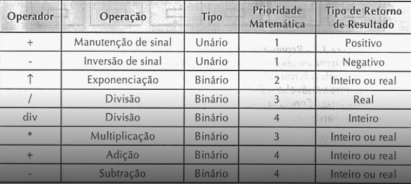
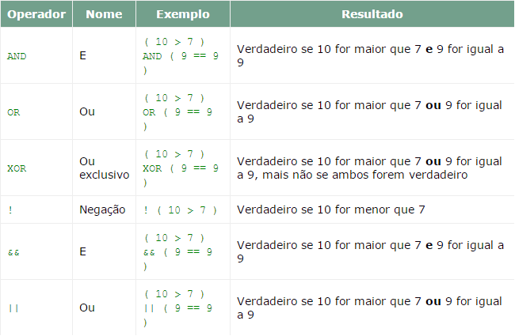

# Lógica de Programação 

***O que é lógica?***
- A lógica vem para solucionar um problema uma proposta duvidosa
- *"Problema é uma questão que foge a uma determinada regra ou melhor é um desvio de percurso, o qual impede de atingir um objetivo com eficiencia e eficácia"*
- *"Organização e planejamento das instruções, assertivas em um algoritmo, a fim de viabilizar a implantação de um programa"*
- Entretanto os seres humanos podem prever comportamentos, computadores não ou seja as intruções precisam ser detalhadas
- *"Everybody in this country should learn how to program a computer because it teaches you how to think"* **Steve Jobs**

## Técnicas de Lógica de programação

***Técnica Linear***

- Modelo Tradicional
- Não tem vínculo
    - Estrutura hierárquica
    - Programação de Computadores
- Execução sequenciada de uma serie de operações 
- Recursos limitados
- Unica dimenção

*Exemplo:*
- Acordar e ir tomar café:

    1º Acordar

    2º Levantar da cama

    3º Descer as escadas

    4º Preparar o café

    5º Sentar e tomar o café 

<br>

***Técnica Estruturada***
- Organização, disposição e ordem dos elementos essenciais que compõem um corpo ( concreto ou abstrato )
- Coloca uma serie de complexidades para que se possa ter algumas vantagens
- Ele coloca meio que uma escolha que de fato não existe na **Linear**


*Exemplo:*
- Acordar e ir tomar café:

    1º Acordar

    2º Levantar da cama

    3º Descer as escadas

    4º Preparar o café **ou** suco

    5º Sentar e tomar o café 

<br>

***Técnica Modular***
- Partes idependentes controladas por um conjuto de regras

- **Daods de Entrada** => **Processo de Trasformação** => **Dados de Saída**
- Simplificação 
- Decompor o problema
- Verificação do módulo

## Fundamentos de algoritmos

### ***Tipologia e variáveis:***
*Qual é a função do computador?*

- Processar informações que passamos para ele e elas se dividem em duas
    - Dados
    - Instruções

E esses dados são tratados e processados, mas quais são os tipos de dados?
- Numéricos
    - Inteiros : 0, 1, 5, 50, 60, 800,...-58, -50, -49
    - Reais : 5.95, 9.54, 0.555, -8.8, 0, 1, 5, 50, 60, 800, -58, -50, -49
- Caractére ( Tudo Aquilo que não é representado como numero, geralemte são delimitado por aspas )
- Lógicos (Tipo Boolenao)
    - true - 1
    - false - 0

Esses são os tipos básicos de dados mais conhecidos como ***tipos primitivos***

<br>

***Variável***

**O que é uma variável ?**
- É um tipo de estrutura mutável e pode possuir variações de valor, ela pode ser sobreescrita e pode mudar seu valor
- Uma estrutura que irá receber um tipo de dado
- Pode assumir qualque um ods valores de um determinado conjunto de valor (Por exmplo ela esta limitada pelo seu tipo primitivo ou seja se a variavel for do tipo numerico ela irá receber so dados do tipo numerico)

**Regras :**
- Atribuição de um ou mais caracteres 
- Primeira letra - não número
- Sem espaços em branco
- Vedado
    - Não permissão na Utilização de palavras reservadas
- Caracteres e números

**Papéis de uma variável:**
- Ação
    - Modificação de estado de algun algoritimo
- Controle
    - Vigiada, Controle de alguma estrutura


### ***Instruções primitivas:***
Elas vão determinar as ações emcima dos nossos dados um exemplo são os cáculos matemáticos usando as variaveis ou as constantes

***Operadores***



<br>

***Definição Formal:***

Instruções são linguagem de **palavras-chave** (vocabulário) de uma determinada de programação que tem por finalidade comandar um computador queirá tratar os dados

### ***Estruturas condicionais e operadores:***

Estado de uma pessoa ou coisa com uma condição

**Condicional :** Que expressa uma condição ou suposição, contem ou implica uma suposição ou hipótese

**Resumindo** funciona como se fosse um **"se"**

*Exemplo:* Vou sair primeiro preciso ver se está chovendo
- **Se** estiver chovendo eu fico em casa
- **Senão** vou ao cinema

A condicional funciona como um meio de caminho para que o programa escolha o caminho referente aos dados que ele vai receber, **"se"** acontecer algo faça(Esse faça é um pedaço de código), **senão** faça isso
 
*Elas são divididas em 3 tipos:*
- Simples: Onde há apenas uma condição ( Um **se** )
- Composta : Onde possui uma excesão ( Um **se** e um **senão** )  

Para auxiliar em uma estrutura condicional é usado os operadores relacionais 


Exemplos:
```
Se(<condição>) então
    <instruções para a condição verdadeira>
fim_se    
```
- Condicional simples
```
Início programa:

A = 0
B = 0
X = 0

leia A
leia B

X = A + B

 se( X > 10 )
    escreva X
 Fim se

Fim programa   
```
- Obs: Na parte A = 0 , a letra A representa uma variavel, e não se diz A **igual** a 0, se diz A **recebe** 0, ou seja a variavel A está recebendo o valor de 0

- Condicional composta
```
Início programa:

A = 0
B = 0
X = 0

leia A
leia B

X = A + B

se( X > 10 )
    escreva X
senão
    escreva "Numero menor que 10"
 Fim se

Fim programa   
```

***Operadores Lógicos :***



<br>

### **Estruturas de repetição :**
Usado quendo você quer repetir o mesmo trecho de  codigo varias vezes geralmente chamado de loop
- Em um loop precisa ter condições de parada para que não haja um loop infinito ou seja nele deve se colocar uma condição e ele irá repetir o trecho de codigo até que a certa condição esteja satisfeita

***"Mas não era só repetir o meu código?"***
- Usando uma estrutura de repetição você reduz linhas
- Melhora a compreensão do seu código
- E tem uma grande redução de possiveis erros

**Exemplo**
- **Enquanto** a grama estiver alta eu vou corta-la
- O **Enquanto** é usado quando eu não sei uma condição de parada ou seja eu não sei quantas vezes eu preciso passar para cortar toda a grama

```portugol
grama = falso

enquanto( grama == falso)faça

    <instrução de cortar a grama>
    <atualiza grama>
fim enquanto
```

- **Repita**: Procurar artigo, virar a página analisar conteudo
- O **Repita** o teste lógico é feito no final ou seja ele garante que o trecho de código seja executado uma vez diferente do **Enquanto** que se a condição for verdadeira ele ja sai e nao executa o código

```portugol
grama = falso

faça
    <instrução de cortar a grama>
    <atualiza grama>
enquanto (grama == falso)

fim faça enquanto
```

- **Para...de..até** usado para quando se sabe a quantidade de repetições 

```
somatorio = 0

para inicio = 1 até 10
    somatório = somatorio + inicio
    Escrevea somatorio
Fim para
```

### ***Vetores e Matrizes :***

***Vetores :***
- Vai ser uma sequencia de dados
- **Definição formal :** Um vetor é caracterizado por uma variavel dimensionada com tamanho pré-fixado
- Variavel que possui uma sequência que pode receber diversos valores

***Matriz :***
- **Definição formal :** Matriz é uma tabela organizada em linhas e colunas no formado m x n, onde **m** representa o numero de lihas (horizontal) e o **n** o número de colunas (vertical)

### ***Funções :***
- *Sininimos que talvez você vá ouvir e saiba que todas se tratam de uma função:*
    - Subalgoritmo
    - Subprograma
    - Bloco
    - Método (Mais para linguagens de programação orietada a objeto [ POO ] )
    - Sub-rotina
- **Dfinição Formal :** As funções, ou sub-rotinas são blocos de instruções que ralizam tarefas específicas, são blocos de instruções(código) identificados por nomes e parÂmetros